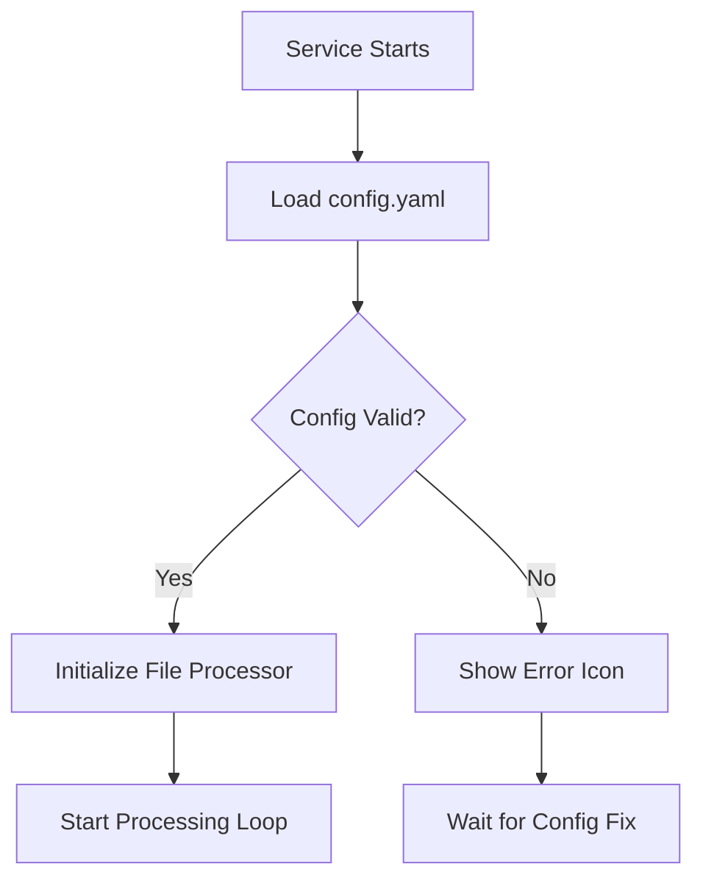
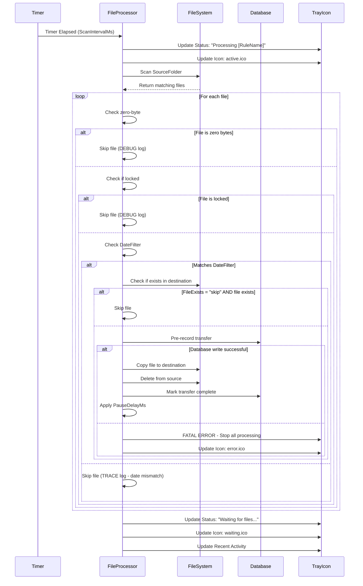

# RJAutoMover File Processing Logic

**Document Version:** 2.0
**Last Updated:** November 21, 2025
**Purpose:** Define the complete logic of how the RJAutoMover service processes files

## 🎯 Overview

RJAutoMover is an automated file processing service that monitors source folders and moves files to destination folders based on configurable rules. The service operates using a timer-based approach with configurable scan intervals for each rule, with intelligent filtering including date-based criteria.

## 📋 Core Processing Logic

### 1. **Service Initialization**


### 2. **File Rule Processing Cycle**

Each **active** file rule operates independently with its own timer:

1. **Timer Setup**: Each active rule gets a `System.Timers.Timer` with interval = `ScanIntervalMs`
2. **File Scanning**: Timer triggers → scan `SourceFolder` for matching files
3. **File Filtering**: Apply zero-byte, lock, and date filters
4. **File Processing**: Process each matching file according to rule settings
5. **Status Updates**: Update tray icon and recent activity list

## 🔧 File Processing Steps (Per Rule)

### Step 1: File Discovery
```csharp
// Get all files in source folder
var files = Directory.GetFiles(rule.SourceFolder)
    .Where(f => extensions.Any(ext =>
        f.EndsWith(ext, StringComparison.OrdinalIgnoreCase)))
    .ToList();
```

**Logic:**
- Scan **only** the `SourceFolder` (no subdirectories)
- Match files against **all extensions** defined in the rule
- Extension matching is **case-insensitive**
- Extensions support multiple formats: `.txt|.log|.csv`
- Special extension: `OTHERS` matches all file types (requires DateFilter)

### Step 2: File Filtering (Multi-Layer)

#### 2a. Zero-Byte Check
```csharp
if (fileInfo.Length == 0) {
    _logger.Log(LogLevel.DEBUG, "Skipping zero-byte file");
    continue;  // Skip this file
}
```

#### 2b. Lock Status Check
```csharp
try {
    using var stream = fileInfo.Open(FileMode.Open, FileAccess.Read, FileShare.None);
} catch (IOException) {
    _logger.Log(LogLevel.DEBUG, "Skipping locked file");
    continue;  // File is in use
}
```

#### 2c. Date Filter Check (NEW)
```csharp
if (!string.IsNullOrWhiteSpace(rule.DateFilter)) {
    var parsed = DateFilterHelper.Parse(rule.DateFilter);

    DateTime fileTimestamp = parsed.Type switch {
        FilterType.LastAccessed => fileInfo.LastAccessTime,
        FilterType.LastModified => fileInfo.LastWriteTime,
        FilterType.FileCreated => fileInfo.CreationTime
    };

    var ageMinutes = (DateTime.Now - fileTimestamp).TotalMinutes;

    bool matches = parsed.Direction == FilterDirection.OlderThan
        ? ageMinutes >= parsed.Minutes  // Positive: older than
        : ageMinutes <= parsed.Minutes; // Negative: within last

    if (!matches) {
        _logger.Log(LogLevel.TRACE, "File does NOT match DateFilter");
        continue;  // Skip this file
    }
}
```

**DateFilter Format:** `"TYPE:SIGN:MINUTES"`
- **TYPE**: `LA` (Last Accessed), `LM` (Last Modified), `FC` (File Created)
- **SIGN**: `+` (older than), `-` (within last)
- **MINUTES**: 1-5256000 (up to 10 years)

**Examples:**
- `"FC:+10080"` = Files created more than 7 days ago
- `"LM:-60"` = Files modified within last 60 minutes
- `"LA:+43200"` = Files NOT accessed in last 30 days

### Step 3: File Existence Check
```csharp
var destPath = Path.Combine(rule.DestinationFolder, fileName);

if (File.Exists(destPath) && rule.FileExists.ToLower() == "skip") {
    // Skip this file
    continue;
}
```

**FileExists Options:**
- **`skip`** (default): Skip files that already exist in destination
- **`overwrite`**: Replace existing files in destination

### Step 4: Activity History Recording
```csharp
// Pre-record transfer in database for accountability
var activityEntry = _activityHistoryService.StartFileTransfer(
    fileName, sourceFile, destPath, rule.Name
);

if (!activityEntry.DatabaseRecordId.HasValue) {
    // CRITICAL: Cannot proceed without audit trail
    _logger.Log(LogLevel.FATAL, "TRANSFER BLOCKED: Cannot move file without recording activity");
    _configErrorMode = true;  // Stop all processing
    break;
}
```

**Accountability:**
- Every file transfer is pre-recorded in SQLite database
- If database write fails, transfer is BLOCKED
- Ensures no "invisible" operations occur
- Service enters error mode if database becomes unavailable

### Step 5: File Movement
```csharp
// Copy file to destination
File.Copy(sourceFile, destPath, rule.FileExists.ToLower() == "overwrite");

// Delete from source (MOVE operation)
File.Delete(sourceFile);

// Mark transfer as complete in database
_activityHistoryService.MarkTransferComplete(activityEntry);
```

**Key Behavior:**
- **MOVE operation**: Files are copied then deleted (not renamed)
- **Atomic operation**: Copy first, then delete (safer for large files)
- **Preserve filename**: No filename modification occurs
- **Flattened structure**: Directory structure is not preserved
- **Database tracked**: Every transfer recorded with timestamps

### Step 6: Processing Delay (Optional)
```csharp
if (_config.Application.PauseDelayMs > 0) {
    await Task.Delay(_config.Application.PauseDelayMs);
}
```

**Purpose:** Throttle processing to avoid overwhelming the system

## 📊 Processing States & Icons

| Service State | Icon | Description |
|---------------|------|-------------|
| **Waiting** | waiting.ico | Service running, no active processing |
| **Active** | active.ico | Currently processing files |
| **Paused** | paused.ico | Processing manually paused by user |
| **Error** | error.ico | Configuration error or system failure |
| **Stopped** | stopped.ico | Service disconnected from tray |

## ⚙️ Configuration Parameters

### File Rule Configuration
```yaml
FileRules:
  - Name: "Document Processor"              # Rule identifier
    SourceFolder: "C:\\Input\\Docs"         # Source directory to monitor
    DestinationFolder: "C:\\Output\\Docs"   # Target directory for processed files
    Extension: ".pdf|.doc|.docx"            # File extensions to process (pipe-separated)
    ScanIntervalMs: 30000                   # Scan frequency in milliseconds (5000-900000)
    FileExists: "skip"                      # Handle existing files: "skip" or "overwrite"
    IsActive: true                          # Enable/disable this rule
    DateFilter: "FC:+10080"                 # NEW: Optional date filtering (7 days old)
```

### DateFilter Examples
```yaml
# Archive old files (created more than 30 days ago)
DateFilter: "FC:+43200"

# Process recent modifications (within last 2 hours)
DateFilter: "LM:-120"

# Move files not accessed in 90 days
DateFilter: "LA:+129600"

# No date filtering (process all matching files)
DateFilter: ""  # or omit the line entirely
```

### Application Configuration
```yaml
Application:
  ProcessingPaused: false         # Manual pause control
  RequireTrayApproval: false      # Autonomous operation (default)
  RetryDelayMs: 5000             # Delay before retrying failed operations (1000-30000)
  FailureCooldownMs: 180000      # Cooldown after failures (0-180000)
  RecheckServiceMs: 30000        # Service health check interval (5000-60000)
  RecheckTrayMs: 30000           # Tray connection check interval (5000-60000)
  PauseDelayMs: 500              # Delay between file operations (0-60000)
  ServiceHeartbeatMs: 300000     # Heartbeat interval (60000-3600000)
  MemoryLimitMb: 512             # Memory limit before restart (128-4096)
  MemoryCheckMs: 60000           # Memory check interval (30000-300000)
  ActivityHistoryEnabled: true    # Enable transfer history database
  ActivityHistoryMaxRecords: 5000      # Max records in database
  ActivityHistoryRetentionDays: 90     # Auto-purge records older than X days
  LogRetentionDays: 7            # Auto-cleanup logs older than X days
```

## 🔄 Processing Flow Diagram



## 🎛️ Rule Activation Logic

### Active Rules
- **Condition**: `IsActive: true`
- **Behavior**: Timer created, files processed according to schedule
- **Validation**: Must pass all configuration validation checks
- **DateFilter**: Optional - if present, must be valid format

### Inactive Rules
- **Condition**: `IsActive: false`
- **Behavior**: No timer created, no file processing
- **Validation**: Configuration still validated but errors don't prevent service startup

### OTHERS Extension Rules (Special)
- **Extension**: `OTHERS` (matches all file types)
- **Requirement**: MUST have a DateFilter (validation enforced)
- **Purpose**: Catch-all for files not matched by specific extension rules
- **Processing Order**: OTHERS rules process AFTER specific extension rules

## 🚨 Error Handling

### File-Level Errors
```csharp
try {
    // Process individual file
} catch (Exception ex) {
    _logger.Log(LogLevel.ERROR, $"Error processing file {sourceFile}: {ex.Message}");
    _activityHistoryService.MarkTransferFailed(activityEntry, ex.Message, attempt);
    // Continue with next file
}
```

**Behavior:** Individual file failures don't stop rule processing

### Rule-Level Errors
```csharp
try {
    // Process entire rule
} catch (Exception ex) {
    _logger.Log(LogLevel.ERROR, $"Error in ProcessFileRule for '{rule.Name}': {ex.Message}");
    // Continue with other rules
}
```

**Behavior:** Rule failures don't stop other rules

### Configuration Errors
- **Invalid config** → Service shows error.ico, stops all processing
- **Config file changed** → Service enters ERROR mode, requires restart
- **Missing folders** → Rule-specific validation failures
- **Permission issues** → Logged but processing continues for other rules
- **Invalid DateFilter format** → Validation error, service enters ERROR mode

### Database Errors (CRITICAL)
```csharp
if (!activityEntry.DatabaseRecordId.HasValue) {
    _logger.Log(LogLevel.FATAL, "TRANSFER BLOCKED: Cannot record activity");
    _configErrorMode = true;
    OnStatusUpdated("Status: Database Error|||Database unavailable. Transfers blocked.");
    OnIconUpdated(IconNames.Error);
    StopAllTimers();
}
```

**Behavior:** Database failures block all transfers (accountability requirement)

## 📈 Performance Characteristics

### Scalability
- **Multiple Rules**: Each rule operates independently with its own timer
- **Timer Overhead**: Minimal - one timer per active rule
- **File System Impact**: Depends on scan intervals and file counts
- **Memory Usage**: Linear with number of files and rules
- **Date Filtering**: Minimal overhead - simple timestamp comparisons

### Optimization Features
- **Case-insensitive extensions**: Efficient string matching
- **Timer-based scanning**: No continuous polling
- **Atomic operations**: Copy-then-delete prevents partial transfers
- **Configurable delays**: Prevents system overload
- **Multi-layer filtering**: Skips problematic files early
- **TRACE logging for dates**: Date checks only logged at TRACE level

## 🔐 Security Considerations

### Permissions Required
- **Read access**: Source folders
- **Write access**: Destination folders, database folder
- **Delete access**: Source folders (for move operation)

### Path Validation
- **Directory existence**: Validated during configuration loading
- **Access rights**: Tested during validation with temp file creation
- **Circular paths**: Prevented (destination cannot be source)
- **Loop detection**: Multi-hop circular chains detected

### Accountability
- **Activity history database**: WAL mode for crash safety
- **Blocked transfers**: If database unavailable, no transfers occur
- **Session tracking**: Unique session ID per service restart
- **Auto-cleanup**: Records older than RetentionDays purged on startup

## 📝 Activity History Tracking

The service maintains persistent activity history in SQLite:

```csharp
// Pre-record transfer
var entry = StartFileTransfer(fileName, sourceFile, destPath, ruleName);

// After successful move
MarkTransferComplete(entry);

// On failure
MarkTransferFailed(entry, errorMessage, attemptNumber);
```

**Features:**
- **Location**: `C:\Program Files\RJAutoMover\Data\ActivityHistory.db`
- **Format**: SQLite with WAL mode
- **Session tracking**: Unique 12-char GUID prefix per service restart
- **Automatic cleanup**: Two independent limits
  - Time-based: Purges records older than `ActivityHistoryRetentionDays`
  - Count-based: Deletes oldest when exceeding `ActivityHistoryMaxRecords`
- **Current session protection**: Current session records never purged
- **Visible to all users**: All users see complete transfer history

## 🎯 Use Cases

### Typical Scenarios
1. **Document Processing**: Move scanned documents from input to organized folders
2. **Log File Management**: Collect log files from multiple sources with date filtering
3. **Media Organization**: Sort images/videos by file type and age
4. **Data Pipeline**: First stage of ETL processes
5. **Backup Automation**: Move files to backup locations
6. **Archive Management**: Move old files based on creation/modification/access dates

### Example Configuration with DateFilter
```yaml
# Multi-department file processing with intelligent date filtering
FileRules:
  # Finance Department - Archive old reports
  - Name: "Finance Archive"
    SourceFolder: "C:\\Shared\\Finance\\Input"
    DestinationFolder: "C:\\Shared\\Finance\\Archive"
    Extension: ".xlsx|.csv|.pdf"
    ScanIntervalMs: 60000
    FileExists: "skip"
    IsActive: true
    DateFilter: "FC:+43200"  # Archive files older than 30 days

  # HR Department - Process recent documents
  - Name: "HR Recent"
    SourceFolder: "C:\\Shared\\HR\\Input"
    DestinationFolder: "C:\\Shared\\HR\\Processed"
    Extension: ".doc|.docx|.pdf"
    ScanIntervalMs: 30000
    FileExists: "overwrite"
    IsActive: true
    DateFilter: "LM:-1440"  # Only files modified within last 24 hours

  # IT Log Collection - Archive old logs
  - Name: "Server Logs"
    SourceFolder: "C:\\Logs\\Temp"
    DestinationFolder: "C:\\Logs\\Archive"
    Extension: ".log|.txt"
    ScanIntervalMs: 60000
    FileExists: "skip"
    IsActive: true
    DateFilter: "FC:+10080"  # Archive logs older than 7 days

  # Cleanup - Remove very old temp files
  - Name: "Temp Cleanup"
    SourceFolder: "C:\\Temp"
    DestinationFolder: "C:\\Deleted"
    Extension: OTHERS  # All file types
    ScanIntervalMs: 86400000  # Once per day
    FileExists: "skip"
    IsActive: true
    DateFilter: "LA:+129600"  # Files not accessed in 90 days (REQUIRED for OTHERS)
```

## 📖 Related Documentation

- **File Filtering Logic**: [FileFilteringLogic.md](FileFilteringLogic.md)
- **DateFilter Helper**: [DateFilterHelper.cs](../RJAutoMoverShared/Helpers/DateFilterHelper.cs)
- **Test Plan**: [TEST_PLAN.md](../TestPlans/TEST_PLAN.md)
- **Testing Scripts**: [TestPlans/](../TestPlans/)
- **Main README**: [README.md](../README.md)

---

**Note:** This documentation reflects the current implementation as of January 2025. The service design prioritizes reliability, configurability, accountability, and operational transparency through comprehensive logging, activity tracking, and intelligent multi-layer filtering including date-based criteria.
