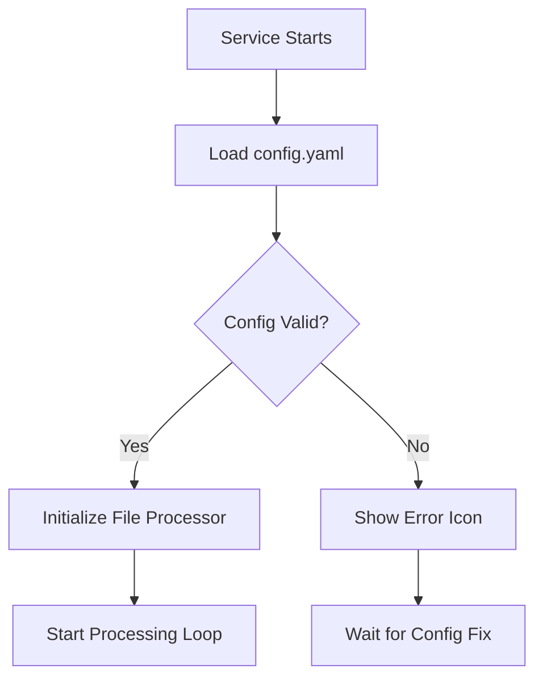
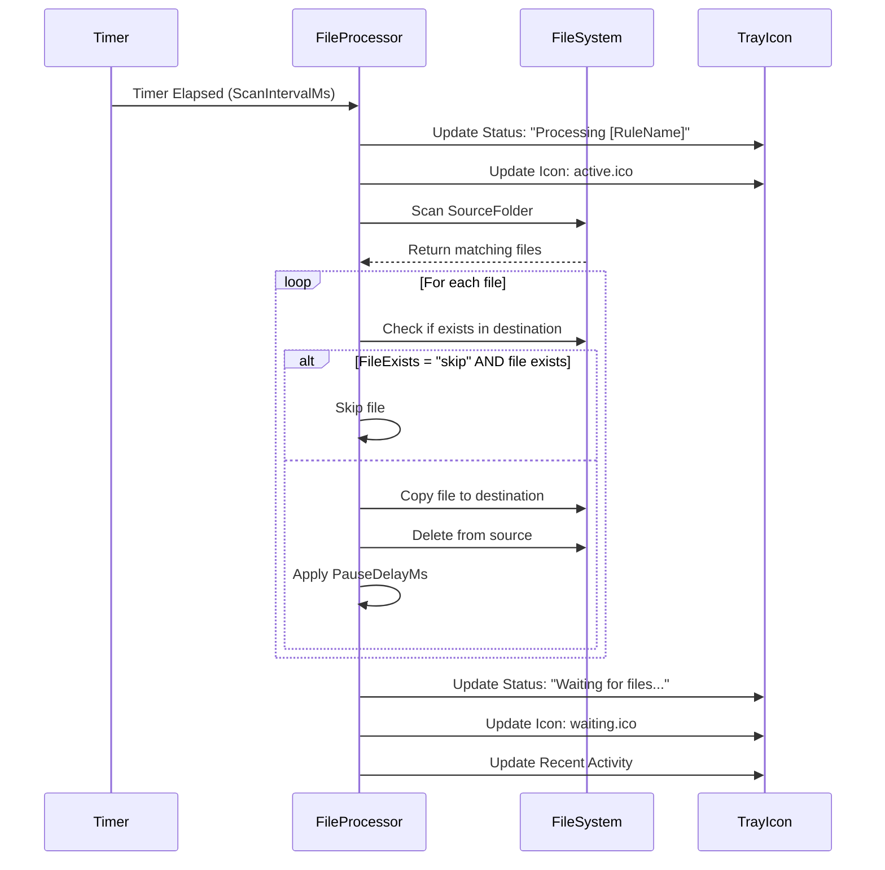

# RJAutoMover File Processing Logic

**Document Version:** 1.0
**Last Updated:** September 21, 2025
**Purpose:** Define the complete logic of how the RJAutoMover service processes files

## 🎯 Overview

RJAutoMover is an automated file processing service that monitors source folders and moves files to destination folders based on configurable rules. The service operates using a timer-based approach with configurable scan intervals for each rule.

## 📋 Core Processing Logic

### 1. **Service Initialization**


### 2. **File Rule Processing Cycle**

Each **active** file rule operates independently with its own timer:

1. **Timer Setup**: Each active rule gets a `System.Timers.Timer` with interval = `ScanIntervalMs`
2. **File Scanning**: Timer triggers → scan `SourceFolder` for matching files
3. **File Processing**: Process each matching file according to rule settings
4. **Status Updates**: Update tray icon and recent activity list

## 🔧 File Processing Steps (Per Rule)

### Step 1: File Discovery
```csharp
// Get all files in source folder
var files = Directory.GetFiles(rule.SourceFolder)
    .Where(f => extensions.Any(ext =>
        f.EndsWith(ext, StringComparison.OrdinalIgnoreCase)))
    .ToList();
```

**Logic:**
- Scan **only** the `SourceFolder` (no subdirectories)
- Match files against **all extensions** defined in the rule
- Extension matching is **case-insensitive**
- Extensions support multiple formats: `.txt|.log|.csv`

### Step 2: File Existence Check
```csharp
var destPath = Path.Combine(rule.DestinationFolder, fileName);

if (File.Exists(destPath) && rule.FileExists.ToLower() == "skip") {
    // Skip this file
    continue;
}
```

**FileExists Options:**
- **`skip`** (default): Skip files that already exist in destination
- **`overwrite`**: Replace existing files in destination

### Step 3: File Movement
```csharp
// Copy file to destination
File.Copy(sourceFile, destPath, rule.FileExists.ToLower() == "overwrite");

// Delete from source (MOVE operation)
File.Delete(sourceFile);
```

**Key Behavior:**
- **MOVE operation**: Files are copied then deleted (not renamed)
- **Atomic operation**: Copy first, then delete (safer for large files)
- **Preserve filename**: No filename modification occurs
- **Flattened structure**: Directory structure is not preserved

### Step 4: Processing Delay (Optional)
```csharp
if (_config.Application.PauseDelayMs > 0) {
    await Task.Delay(_config.Application.PauseDelayMs);
}
```

**Purpose:** Throttle processing to avoid overwhelming the system

## 📊 Processing States & Icons

| Service State | Icon | Description |
|---------------|------|-------------|
| **Waiting** | waiting.ico | Service running, no active processing |
| **Active** | active.ico | Currently processing files |
| **Paused** | paused.ico | Processing manually paused by user |
| **Error** | error.ico | Configuration error or system failure |
| **Stopped** | stopped.ico | Service disconnected from tray |

## ⚙️ Configuration Parameters

### File Rule Configuration
```yaml
FileRules:
  - Name: "Document Processor"           # Rule identifier (max 20 chars, alphanumeric)
    SourceFolder: "C:\\Input\\Docs"      # Source directory to monitor
    DestinationFolder: "C:\\Output\\Docs" # Target directory for processed files
    Extension: ".pdf|.doc|.docx"         # File extensions to process (pipe-separated)
    ScanIntervalMs: 30000                # Scan frequency in milliseconds (100-60000)
    FileExists: "skip"                   # Handle existing files: "skip" or "overwrite"
    IsActive: true                       # Enable/disable this rule
```

### Application Configuration
```yaml
Application:
  ProcessingPaused: false      # Manual pause control
  RetryDelayMs: 5000          # Delay before retrying failed operations (1000-30000)
  FailureCooldownMs: 180000   # Cooldown after failures (0-180000)
  RecheckServiceMs: 30000     # Service health check interval (5000-60000)
  RecheckTrayMs: 30000        # Tray connection check interval (5000-60000)
  PauseDelayMs: 500           # Delay between file operations (0-60000)
```

## 🔄 Processing Flow Diagram



## 🎛️ Rule Activation Logic

### Active Rules
- **Condition**: `IsActive: true`
- **Behavior**: Timer created, files processed according to schedule
- **Validation**: Must pass all configuration validation checks

### Inactive Rules
- **Condition**: `IsActive: false`
- **Behavior**: No timer created, no file processing
- **Validation**: Configuration still validated but errors don't prevent service startup

## 🚨 Error Handling

### File-Level Errors
```csharp
try {
    // Process individual file
} catch (Exception ex) {
    _logger.Log(LogLevel.ERROR, $"Error processing file {sourceFile}: {ex.Message}");
    // Continue with next file
}
```

**Behavior:** Individual file failures don't stop rule processing

### Rule-Level Errors
```csharp
try {
    // Process entire rule
} catch (Exception ex) {
    _logger.Log(LogLevel.ERROR, $"Error in ProcessFileRule for '{rule.Name}': {ex.Message}");
    // Mark rule execution as failed in recent activity
}
```

**Behavior:** Rule failures don't stop other rules

### Configuration Errors
- **Invalid config** → Service shows error.ico, stops all processing
- **Missing folders** → Rule-specific validation failures
- **Permission issues** → Logged but processing continues for other rules

## 📈 Performance Characteristics

### Scalability
- **Multiple Rules**: Each rule operates independently with its own timer
- **Timer Overhead**: Minimal - one timer per active rule
- **File System Impact**: Depends on scan intervals and file counts
- **Memory Usage**: Linear with number of files and rules

### Optimization Features
- **Case-insensitive extensions**: Efficient string matching
- **Timer-based scanning**: No continuous polling
- **Atomic operations**: Copy-then-delete prevents partial transfers
- **Configurable delays**: Prevents system overload

## 🔐 Security Considerations

### Permissions Required
- **Read access**: Source folders
- **Write access**: Destination folders
- **Delete access**: Source folders (for move operation)

### Path Validation
- **Directory existence**: Validated during configuration loading
- **Access rights**: Tested during validation with temp file creation
- **Path traversal**: No explicit protection (trusted configuration)

## 📝 Recent Activity Tracking

The service maintains a recent activity log:

```csharp
var recentEntry = $"{DateTime.Now:HH:mm:ss} - {rule.Name} - {(success ? "✔" : "✗")}";
```

**Features:**
- **Format**: `HH:mm:ss - RuleName - ✔/✗`
- **Capacity**: Maximum 30 entries (FIFO)
- **Success indicator**: ✔ for files processed, ✗ for failures
- **Real-time updates**: Visible in tray context menu

## 🎯 Use Cases

### Typical Scenarios
1. **Document Processing**: Move scanned documents from input to organized folders
2. **Log File Management**: Collect log files from multiple sources
3. **Media Organization**: Sort images/videos by file type
4. **Data Pipeline**: First stage of ETL processes
5. **Backup Automation**: Move files to backup locations

### Example Configuration
```yaml
# Multi-department file processing
FileRules:
  # Finance Department
  - Name: "Finance Docs"
    SourceFolder: "C:\\Shared\\Finance\\Input"
    DestinationFolder: "C:\\Shared\\Finance\\Processed"
    Extension: ".xlsx|.csv|.pdf"
    ScanIntervalMs: 15000
    FileExists: "skip"
    IsActive: true

  # HR Department
  - Name: "HR Documents"
    SourceFolder: "C:\\Shared\\HR\\Input"
    DestinationFolder: "C:\\Shared\\HR\\Processed"
    Extension: ".doc|.docx|.pdf"
    ScanIntervalMs: 30000
    FileExists: "overwrite"
    IsActive: true

  # IT Log Collection
  - Name: "Server Logs"
    SourceFolder: "C:\\Logs\\Temp"
    DestinationFolder: "C:\\Logs\\Archive"
    Extension: ".log|.txt"
    ScanIntervalMs: 60000
    FileExists: "skip"
    IsActive: true
```

---

**Note:** This documentation reflects the current implementation as of October 2025. The service design prioritizes reliability, configurability, and operational transparency through comprehensive logging and status reporting.